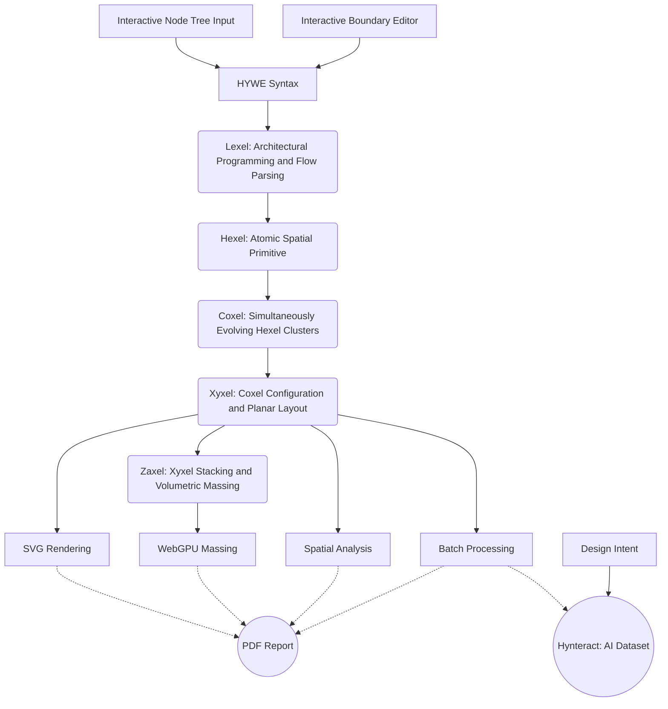

**HYWE** is a **browser-based** design sandbox where **structured intent** metamorphoses into **spatial configurations** through **design computation**.

---


---
# H Y W E

**Hy**grid **W**oven **E**nsemble

[](LICENSE)

---

## Philosophy

HYWE is founded on the idea that **spatial reasoning can be expressive and computational without imitating traditional architectural software**. It encourages a form of design thinking where **spatial topology and flow-based hierarchy** guide the creation of layouts. At its core is the **Hygrid**, a hybrid orthogonal-hexagonal grid system that enables the composition of unconventional spatial topologies through procedural logic, functioning conceptually as a **computational 'bubble diagram'** where spatial adjacency is a direct consequence of defined connections and intent.

As a **bespoke, zero-dependency engine**, HYWE operates on a logic where **HYWE Syntax is the singular source of truth**. The engine **weaves** abstract spatial definitions into a cohesive **Ensemble** - a coherent, emergent structure resolved through native **Boolean-driven topological logic** without dependence on external geometry kernels or optimization solvers. In this ecosystem, design intent is encoded into a logic-driven language where geometry depends entirely on the integrity of the syntax.

---

## Access

[Open HYWE in your browser — No installation or Sign-in required](https://vykrum.github.io/Hywe/)  

## The Workspace

https://github.com/user-attachments/assets/cc523e4c-ca69-431a-8cbb-eb58c001b3dc

---

## Features

- **Topology & Flow**: Topology-first spatial flow editor with real-time mapping of structural relationships.
- **Visual Performance**: High-performance 2D SVG layouts and 3D extrusions via **WebGPU** hardware acceleration.
- **Generative Core**: Dynamic, multi-level layout generation via procedural logic for massive architectural dataset creation.
- **Deterministic Logic**: Purely functional, **integer-based** spatial partitioning ensuring **bit-precise data generation** (no floating-point drift) for AI training and AEC interoperability.
- **Extensibility**: Transparent, text-based syntax with native support for industry formats for seamless integration with professional design workflows. The core is decoupled as a pure **F#** library for programmatic API potential.
- **Stateless Sharing**: Share entire 3D designs via simple URLs; the Syntax is serialized directly into the URL hash with no database required.
- **Edge Architecture**: Built from first principles in **F#** and compiled to **WASM** for a zero-install, privacy-focused PWA with all computation running client-side (zero server round-trips).

---

## Sitemap of Logic

HYWE is structured as a computational pipeline that transforms designer intent into architectural form:

| Stage | Component | Logic | Output |
| :--- | :--- | :--- | :--- |
| **Intent** | `Interactive Node Tree Input` & `Interactive Boundary Editor` | Defining spatial rules and physical constraints. | Design Intent |
| **Encoding** | HYWE Syntax | Compact, deterministic encoding of design rules. | `.hyw` String |
| **Parsing** | `Lexel` | **Architectural programming** and flow parsing. | `TreeNode` Hierarchy |
| **Formation** | `Hexel` & `Coxel` | **Fundamental Units** and **Spatial Clustering**. | Geometric Fabric |
| **Distribution** | `Xyxel` | **Coxel Configuration** and 2D layout. | SVG Rendering |
| **Massing** | `Zaxel` | **Xyxel Stacking** and 3D volume. | WebGPU Massing |
| **Expansion** | `Batch` & `Teach` | **Variation processing** and **dataset generation**. | AI Dataset (Hynteract) |
| **Insight** | `Analyze` & `Report` | **Spatial metrics** and **automated documentation**. | PDF Report |

## Targeted Use Cases

HYWE is engineered to solve specific high-intent architectural bottlenecks:
- **Automate Architectural Programming**: Rapidly synthesize programmatic requirements and hierarchical trees into structured spatial configurations.
- **Boundary Confinement**: Confine spatial configurations to arbitrary closed boundaries, from rectilinear sites to complex polygonal footprints with islands.
- **Vertical Hierarchy**: Handle programmatic stacking diagrams and multi-level distribution in a zero-install web environment.
- **Hybrid AI Foundation**: Provides a **deterministic foundation** for layout generation, ensuring logical consistency when leveraging generative AI for creative exploration.

---

## Technical Stack

- **Language:** [F#](https://fsharp.org/) (functional-first design)
- **Frontend:** [Bolero](https://fsbolero.io/) (Blazor on WASM)
- **3D Graphics:** [WebGPU](https://gpuweb.github.io/gpuweb/) (native massing)

## Technical Architecture

HYWE is built as a **strictly functional engine**. It treats spatial design as a computational problem, where inputs are transformed through a series of geometric and topological "folds".




---

## Development & Community

We are building HYWE as an open ecosystem for **design computation**.

- **Contribute**: See our [Contributing Guide](CONTRIBUTING.md) to get started.
- **AI-Friendly**: Technical summary for AI agents available at [llms.txt](llms.txt).

---

## Citation

If you use HYWE in your research or professional projects, please cite it using the following metadata:

```text
Subbaiah, V. (2026). HYWE: Hygrid Woven Ensemble. 
Retrieved from https://github.com/vykrum/Hywe
```

Or use the "Cite this repository" button in the GitHub sidebar.

---

## License

This project is licensed under the [MIT License](LICENSE).
