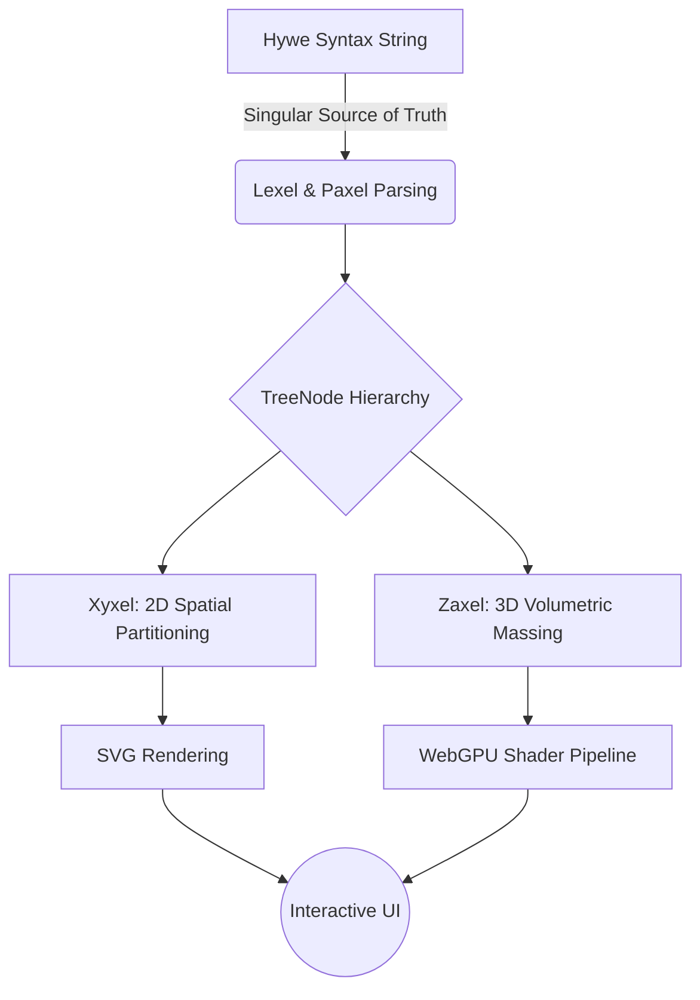

**HYWE** is a **browser-based** design sandbox where **structured intent** metamorphoses into **spatial configurations** through **design computation**.

---


---
# H Y W E

**Hy**grid **W**oven **E**nsemble

[](LICENSE)

---

## Philosophy

Hywe is founded on the idea that **spatial reasoning can be expressive and computational without imitating architectural software norms**. It encourages a form of design thinking where **spatial topology and flow-based hierarchy** guide the creation of layouts. By prioritizing the "logic of movement" over simple wall-to-wall adjacency, Hywe uses a procedural approach to turn abstract intent into structured configurations. Every aspect of the system, from interactivity to structure, has been built from scratch to reflect this paradigm.

At its core, **Hywe Syntax is the singular source of truth**. Every spatial configuration, volumetric massing, and topological relationship is a direct derivation of this syntax. In this ecosystem, design intent is encoded into a logic-driven language where everything—from geometry to hierarchy—depends on the integrity of the string.

---

## Access

[Open Hywe in your browser — No installation or Sign-in required](https://vykrum.github.io/Hywe/)  

## The Workspace

https://github.com/user-attachments/assets/cc523e4c-ca69-431a-8cbb-eb58c001b3dc

---

## Features

- **Topology-first** spatial flow editor: Prioritize connections and sequence over static geometry.
- **Flow-based hierarchy** visualization: Real-time mapping of structural relationships.
- **2D layouts** visualized with high-performance **SVG**.
- **3D extrusions** rendered using **WebGPU** for modern hardware acceleration.
- **Generative Design**: Dynamic, multi-level layout generation via procedural logic.
- **Dataset Generation**: Use the syntax-driven core to generate massive, procedurally varied architectural datasets.
- **Extensibility**: Uses a transparent, text-based syntax designed to enable straightforward integration with other **AEC tools** and Common Data Environments (CDE).
- **API Potential**: The engine is built as a decoupled **WebAssembly core**, allowing for future integration as a programmatic design API for third-party web apps.
- **Stateless Sharing**: Share entire 3D design states via simple URLs. No sign-in or database required; the Syntax is serialized directly into the URL hash.
- **Privacy-focused**: No backend; all computation runs in-browser via **WebAssembly**.
- **Edge-First Architecture**: 
    - **Zero-Latency**: Instantaneous procedural feedback with no round-trips to a server.
    - **Offline-Ready**: As a Progressive Web App (PWA) with a WASM core, Hywe is designed for reliable performance in any environment.
    - **Secure**: Your design intent and data never leave your machine.

> [!TIP]
> You can access the **Hywe Syntax guide** directly within the app by using the **Node/Code toggle** in the workspace.

---

## Sitemap of Logic

Hywe is a single-page application where the structure is defined by the **computational pipeline**, not the URL path.

| Stage | Component | Logic | Output |
| :--- | :--- | :--- | :--- |
| **1. The Seed** | Hywe Syntax | Compact, text-based encoding of design intent. | `.hyw` String |
| **2. Interpretation** | `Lexel` & `Paxel` | Functional parsing of hierarchical attributes. | `TreeNode` Hierarchy |
| **3. Orchestration** | `Hywe.Tree` | Centralized management of spatial relationships. | Logical Spine |
| **4. Generation** | `Xyxel` & `Zaxel` | Recursive partitioning and volumetric massing. | Spatial Mesh / SVG |
| **5. Projection** | SVG & WebGPU | High-performance 2D/3D visualization. | Interactive UI |

---

## Technical Architecture

Hywe is built as a **strictly functional engine**. It treats spatial design as a computational problem, where inputs are transformed through a series of geometric and topological "folds".



- **Language:** [F#](https://fsharp.org/) (functional-first design)
- **Frontend:** [Bolero](https://fsbolero.io/) (Blazor on WASM)
- **3D Graphics:** [WebGPU](https://gpuweb.github.io/gpuweb/) (via custom shader pipeline)
- **Geometry Logic:** Purely functional tree-based spatial partitioning.

---

## Development & Community

We are building Hywe as an open ecosystem for **design computation**.

- **Contribute**: See our [Contributing Guide](CONTRIBUTING.md) to get started.
- **AI-Friendly**: Technical summary for AI agents available at [llms.txt](llms.txt).
- **Roadmap**: Check out the [Issues](https://github.com/vykrum/Hywe/issues) for planned features like deep architectural nesting and enhanced WebGPU massing.

---

## Citation

If you use Hywe in your research or professional projects, please cite it using the following metadata:

```text
Subbaiah, V. (2026). HYWE: Hygrid Woven Ensemble. 
Retrieved from https://github.com/vykrum/Hywe
```

Or use the "Cite this repository" button in the GitHub sidebar (provided by the `CITATION.cff` file).

---

## License

This project is licensed under the [MIT License](LICENSE).
