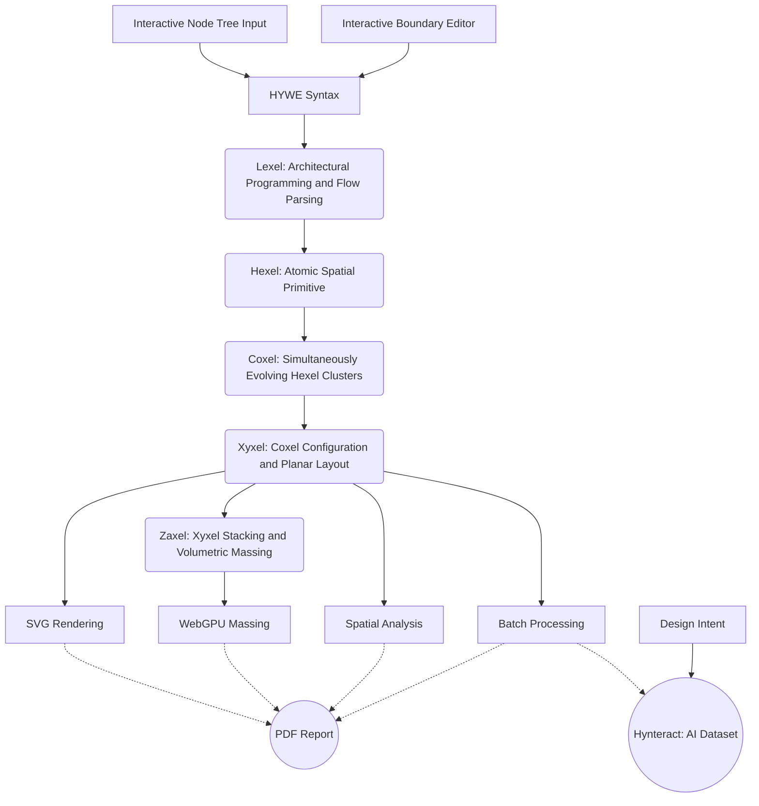

**HYWE** is a **browser-based** design sandbox where **structured intent** metamorphoses into **spatial configurations** through **deterministic design computation**.

---

---
# H Y W E

**Hy**grid **W**oven **E**nsemble

    

**[Launch HYWE](https://vykrum.github.io/Hywe/)**

*Actively evolving. WebGPU browser recommended.*

---

## Philosophy

HYWE is an investigation into Spatial reasoning as a function of computational logic. It encourages a form of design thinking where **topology and flow-based hierarchy** guide the creation of layouts.

At its core is the **Hygrid**, a hybrid orthogonal-hexagonal grid system that functions conceptually as a computational 'bubble diagram' where spatial adjacency is a direct consequence of defined connections rather than manual drafting.

As a zero-dependency engine, HYWE operates on a logic where **Syntax is the singular source of truth**. The engine weaves abstract spatial definitions into a cohesive **Ensemble**, an emergent structure resolved through native Boolean-driven topological logic, completely independent of external geometry kernels or optimization solvers.

---

## The Workspace

https://github.com/user-attachments/assets/cc523e4c-ca69-431a-8cbb-eb58c001b3dc

---

## Operational Domain

HYWE functions as a computational sandbox bridging abstract intent and physical constraint. The engine translates **architectural programming**, specifically hierarchical trees and flow sequences, directly into resolved topological configurations, where adjacency emerges as a structural consequence rather than a predetermined matrix input.

The spatial logic within HYWE incorporates **boundary confinement**, allowing configurations to organically adapt to irregular site boundaries and non-standard footprints. Furthermore, this topological reasoning extends vertically to resolve **programmatic stacking** and multi-level flow distribution across a building mass.

---

## Core Pipeline

HYWE is structured as a computational pipeline that transforms designer intent into architectural form:

| Stage | Component | Logic | Output |
| :--- | :--- | :--- | :--- |
| **Intent** | `Interactive Node Tree Input` & `Interactive Boundary Editor` | Defining spatial rules and physical constraints. | Design Intent |
| **Encoding** | HYWE Syntax | Compact, deterministic encoding of design rules. | `.hyw` String |
| **Parsing** | `Lexel` | **Architectural programming** and flow parsing. | `TreeNode` Hierarchy |
| **Formation** | `Hexel` & `Coxel` | **Fundamental Units** and **Spatial Clustering**. | Geometric Fabric |
| **Distribution** | `Xyxel` | **Coxel Configuration** and 2D layout. | SVG Rendering |
| **Massing** | `Zaxel` | **Xyxel Stacking** and 3D volume. | WebGPU Massing |
| **Expansion** | `Batch` & `Teach` | **Variation processing** and **dataset generation**. | AI Dataset (via Hynteract) |
| **Insight** | `Analyze` & `Report` | **Spatial metrics** and **automated documentation**. | PDF Report |

---

### Data Pipeline

Within broader computational ecosystems, HYWE acts as a **deterministic foundation** for machine learning workflows. By prioritizing absolute geometric consistency and integer-based spatial partitioning, it provides a logic-driven substrate for **architectural dataset generation** via the serverless **Hynteract** data pipeline. This ensures bit-precise structural integrity when training or anchoring generative AI models.

Instead of exporting heavy geometric files (like OBJ or IFC), HYWE encodes entire spatial flow hierarchies known as `HYWE Syntax` into a highly compressed **Base34** string representation. Hynteract captures these text-based topological tokens, pairs them with natural language prompts, and structures them into highly efficient JSON Lines (`.jsonl`) datasets. Because HYWE can calculate multiple valid permutations of layouts for a given input, the Hynteract pipeline automates the batch processing of large volumes of topological states, routing them directly to the **[HYWE Architectural Training Data](https://huggingface.co/datasets/vykrum/hywe-training-data)** dataset on Hugging Face — forming the foundation for custom AI model training.

---

## Technical Architecture

HYWE is built as a **strictly functional engine**. It treats spatial design as a computational problem, where inputs are transformed through a series of deterministic geometric and topological transformations.

---

## Technical Stack

- **Language:** [F#](https://fsharp.org/) (functional-first design)
- **Frontend:** [Bolero](https://fsbolero.io/) (Blazor on WASM)
- **3D Graphics:** [WebGPU](https://gpuweb.github.io/gpuweb/) (native massing)

---

## Development

HYWE is an open project exploring **design computation**. 

Those interested in extending the engine or exploring its procedural logic can refer to the [Contributing Guide](CONTRIBUTING.md). Additionally, a technical summary of the architecture is maintained at [llms.txt](llms.txt) for AI agents and automated analysis.

---

## License

This project is licensed under the [MIT License](LICENSE).
