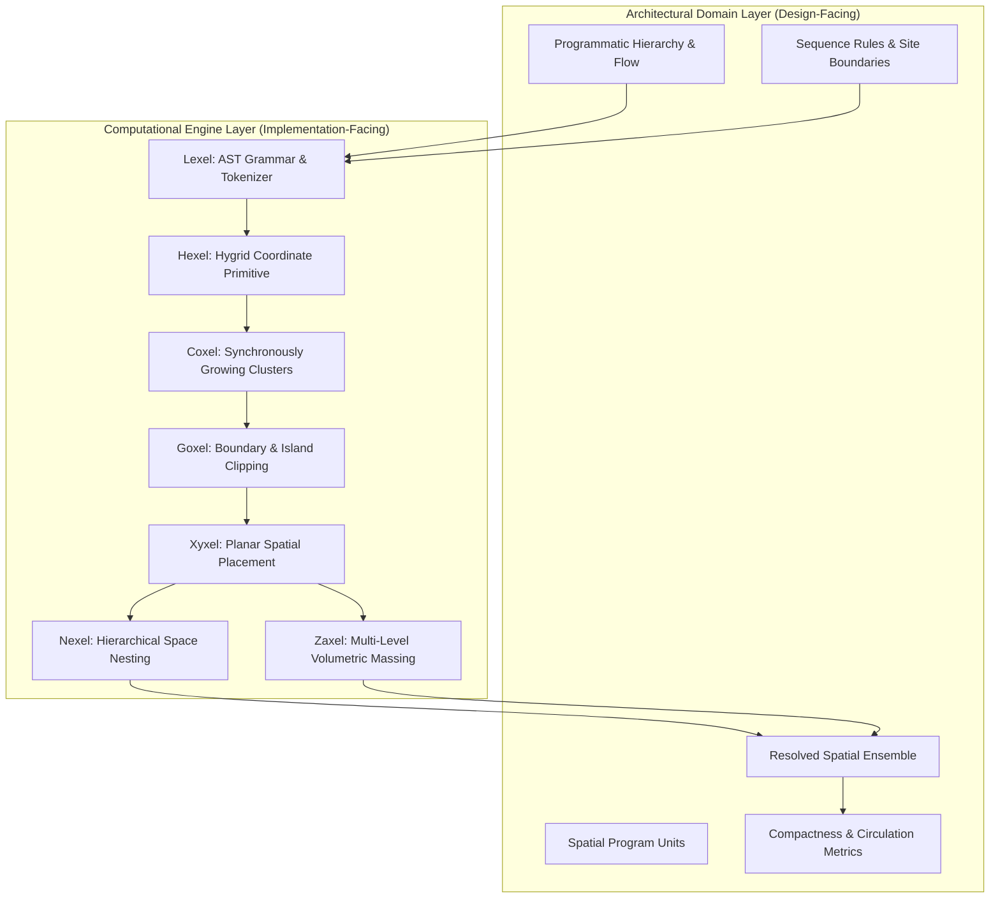

# H Y W E
### **Hy**grid **W**oven **E**nsemble
*A deterministic computational spatial reasoning system for early-stage architecture.*

[](LICENSE) [](https://fsharp.org/) [](https://webassembly.org/) [](https://gpuweb.github.io/gpuweb/) [](https://huggingface.co/datasets/vykrum/hywe-training-data)

**[Launch HYWE (hywe.in)](https://hywe.in)** · **[Wiki & Research Reference](https://wiki.hywe.in)** · **[Spatial Dataset](https://data.hywe.in)**

---


> **HYWE** is a computational design environment and experimental research project where **structured intent** transforms into **spatial configurations** through **deterministic computation**.
>
> - **[HYWE Web App](https://hywe.in)** (`hywe.in`) — Direct-manipulation spatial design environment.
> - **[HYWE Engine](https://github.com/vykrum/Hywe)** (`repo.hywe.in`) — Open-source computational engine.
> - **[HYWE Wiki](https://wiki.hywe.in)** (`wiki.hywe.in`) — Comprehensive research documentation, ontology, and specifications.
> - **[HYWE Spatial Dataset](https://data.hywe.in)** (`data.hywe.in`) — Structured corpus of procedural design intent and deterministic configurations.

---

## The Architectural Proposition: Relationships Before Geometry

In traditional CAD and BIM environments, geometry is drawn manually while relationships remain implicit. In generative diffusion models, images are stochastically sampled without topological guarantees or spatial continuity.

**HYWE inverts this paradigm:**
$$\text{Programmatic Intent} \longrightarrow \text{Relational Topology} \longrightarrow \text{Deterministic Permutations} \longrightarrow \text{Resolved Geometry}$$

1. **Relationships Before Geometry**: Designers define programmatic hierarchies, room capacities, and flow dependencies. Spatial boundaries and layouts are calculated as emergent consequences of those relationships.
2. **Connectivity Over Adjacency**: Connectivity is the declared architectural requirement in the program graph; adjacency emerges organically from topological packing, sequence operators, and boundary constraints.
3. **Deterministic Spatial Synthesis**: No random seeds, no hallucinated geometry. For a fixed engine version, identical canonical inputs always resolve into the exact same spatial configuration.

> [!IMPORTANT]
> **Operational Scope**: HYWE is strictly an exploratory layout engine and spatial reasoning apparatus, not a detailed building modeling platform or construction lifecycle suite. It operates exclusively at early-stage architectural programming, zoning, and volumetric massing.

---

## The 30-Second Workflow

```text
Step 1: Declare Intent              Step 2: Choose Rules           Step 3: Generate           Step 4: Compare
Entrance (Level 0)                 Sequence Operators (24)       Deterministic Planar       Compactness: 0.82
├── Lobby                          Boundary Confinement          & 3D Massing Layouts       Graph Adjacency: 100%
│   ├── Exhibition (Public)   ───► Keep-out Island Rules    ───► Across All Canonical  ───► Boundary Spill: 0%
│   └── Admin (Restricted)         Growth Direction              Permutations               Export SVG / PDF / Data
└── Services
```

1. **Declare Intent**: Construct an architectural hierarchy in the Interactive Node Tree or via compact syntax `(1/15/Lobby)`.
2. **Define Constraints**: Sketch site boundaries or internal courtyard/void islands in the Polygon Boundary Editor.
3. **Generate Configurations**: The engine sweeps through 24 canonical sequence operators, computing bit-exact planar packings and 3D massings.
4. **Evaluate & Export**: Inspect quantitative compactness, verified adjacency matrices, and export vector SVGs, multi-page PDF dossiers, or dataset records.

---

### Overview Video
<video src="https://github.com/user-attachments/assets/b285dbd8-33bd-45c1-998e-87e2ce0b0d0d" width="100%" controls autoplay loop muted></video>

### Interface & Functional Modules
*Click any interface preview to view in full resolution.*

| **Intro & Hierarchy** | **Layout Generation** | **Volumetric Massing** | **Spatial Analysis** |
| :---: | :---: | :---: | :---: |
| <a href="https://github.com/user-attachments/assets/0e30e79a-f130-4d64-9119-c8e66a4fd6a9"></a><br/><sub>Interactive node-tree programmatic hierarchy</sub> | <a href="https://github.com/user-attachments/assets/4ef3335f-d905-43fa-ac98-3226700249a6"></a><br/><sub>Deterministic Hygrid planar packing & SVG export</sub> | <a href="https://github.com/user-attachments/assets/eba2ff4f-c36b-49a3-9500-3e7192bf7f1a"></a><br/><sub>WebGPU 3D vertical stacking & massing</sub> | <a href="https://github.com/user-attachments/assets/dc798c70-4da7-45b7-8334-4749fe857689"></a><br/><sub>Compactness metrics & graph adjacency verification</sub> |
| **Procedural Generation** | **Boundary Condition** | **Dataset Preparation** | **Report Compilation** |
| <a href="https://github.com/user-attachments/assets/e017254d-b070-47b0-994e-1a7f07419787"></a><br/><sub>24 canonical operator sequence sweeps</sub> | <a href="https://github.com/user-attachments/assets/dde4d99e-5f6f-481e-bfd2-16388f92801c"></a><br/><sub>Polygon boundary capture & site confinement</sub> | <a href="https://github.com/user-attachments/assets/9156d9e1-965f-4b63-8267-381fbdd28341"></a><br/><sub>Base34 grid compression & JSONL dataset commit</sub> | <a href="https://github.com/user-attachments/assets/bfd74716-dd8d-46f3-aba8-1ac531f966d5"></a><br/><sub>Automated multi-page PDF spatial dossiers</sub> |

---

## Two-Layer Architecture & Platform Ontology

HYWE deliberately maintains a **two-layer vocabulary architecture** ([Platform Ontology](https://wiki.hywe.in/Platform-Ontology)), preventing low-level implementation mechanics from obscuring architectural thinking:


```mermaid
graph TD
    subgraph "Architectural Domain Layer (Design-Facing)"
        Intent[Programmatic Hierarchy & Flow]
        Rules[Sequence Rules & Site Boundaries]
        SpatialUnit[Spatial Program Units]
        SpatialEnsemble[Resolved Spatial Ensemble]
        AnalysisOut[Compactness & Circulation Metrics]
    end

    subgraph "Computational Engine Layer (Implementation-Facing)"
        Lexel[Lexel: AST Grammar & Tokenizer]
        Hexel[Hexel: Hygrid Coordinate Primitive]
        Coxel[Coxel: Synchronously Growing Clusters]
        Goxel[Goxel: Boundary & Island Clipping]
        Xyxel[Xyxel: Planar Spatial Placement]
        Nexel[Nexel: Hierarchical Space Nesting]
        Zaxel[Zaxel: Multi-Level Volumetric Massing]
    end

    Intent --> Lexel
    Rules --> Lexel
    Lexel --> Hexel
    Hexel --> Coxel
    Coxel --> Goxel
    Goxel --> Xyxel
    Xyxel --> Nexel
    Xyxel --> Zaxel
    Nexel --> SpatialEnsemble
    Zaxel --> SpatialEnsemble
    SpatialEnsemble --> AnalysisOut
```

| Architectural Concept | Engine Component | Mathematical Transformation | Output |
| :--- | :--- | :--- | :--- |
| **Program Intent** | `Lexel` | AST tokenization and parent-child hierarchy validation | Abstract Program Tree |
| **Spatial Discretization** | `Hexel` | Coordinate quantization onto the integer Hygrid lattice | Integer Coordinate Triples $(x,y,z)$ |
| **Spatial Clustering** | `Coxel` | Synchronous cluster growth and collision avoidance | Clustered Tile Envelopes |
| **Site Confinement** | `Goxel` | Polygon clipping, site boundaries, and keep-out islands | Verified Boundary Contours |
| **Planar Configuration** | `Xyxel` | Sequence-driven 2D placement and rotation sweeps | Planar Layout & Vector SVG |
| **Hierarchical Nesting** | `Nexel` | Sub-space confinement within parent spatial footprints | Multi-level Nesting |
| **Volumetric Stacking** | `Zaxel` | Vertical floor assignments and elevation extrusion | WebGPU 3D Mesh |

---

## Research Rigor & Deterministic Compiler Guarantees

HYWE's formal guarantees are codified in the [Canonical Conformance Specification](https://wiki.hywe.in/Canonical-Conformance-Specification):

1. **Fixed Engine Version Invariant**:
   $$F(P, Q, L, O, I) \longrightarrow C$$
   For any programmatic intent $P$, sequence operator $Q$, level $L$, boundary $O$, and islands $I$, identical inputs evaluated on the same engine version yield the identical discrete configuration $C$.
2. **Zero Hash Divergence**: Across 720 empirical benchmark evaluations (72 canonical configurations $\times$ 10 runs), the engine demonstrated **100.0% state validity and zero hash divergence**.
3. **Sub-Second Compilation Budget**: Core compilation absorbs layout synthesis at ~1 s for 1,000 synthetic nodes under WebAssembly (.NET 10), strictly decoupled from browser DOM mutation and WebGPU rendering passes ([Benchmarks](https://wiki.hywe.in/Benchmarks)).
4. **Emergent Circulation Hypothesis**: Investigates whether navigational structure emerges directly from programmatic relations and lattice packing, rather than being imposed as a pre-modeled static corridor network.

---

## Downstream Application: HYWE Spatial Configuration Dataset

HYWE provides an automated pipeline contributing to the open **[HYWE Spatial Configuration Dataset](https://huggingface.co/datasets/vykrum/hywe-training-data)** on Hugging Face:

$$\text{Design Intent} \longrightarrow \text{HYWE Syntax} \longrightarrow \text{24 Sequence Sweeps} \longrightarrow \text{Hynteract Ingestion} \longrightarrow \text{JSONL Spatial Corpus}$$

* **Bit-Exact Base34 Coordinate Compression**: Integer coordinates are compressed into Base34 strings using a canonical 34-symbol alphabet (`0-9`, `A-H`, `J-N`, `P-Z`), omitting `I` and `O` to prevent visual and OCR ambiguity.
* **Hynteract Provenance Gate**: Submissions pass through the [Hynteract](https://github.com/vykrum/Hynteract) ingestion service for grammar validation, profanity/link scanning, duplicate detection, and pre-flight cache readiness checks.

---

## Technical Stack

* **Language**: [F#](https://fsharp.org/) (functional-first, dependency-free core engine)
* **Frontend**: [Bolero](https://fsbolero.io/) (Blazor WebAssembly with Elmish architecture)
* **3D Graphics**: [WebGPU](https://gpuweb.github.io/gpuweb/) (zero-dependency native shader pipeline)
* **Persistence & Moderation**: Serverless Node.js edge functions ([Hynteract](https://github.com/vykrum/Hynteract))

---

## Documentation & Research Reference

* **[HYWE Wiki (wiki.hywe.in)](https://wiki.hywe.in)**:
  * **01 — Understand**: [[Philosophy]](https://wiki.hywe.in/Computational-Spatial-Design) · [[Ontology]](https://wiki.hywe.in/Platform-Ontology) · [[Guarantees]](https://wiki.hywe.in/Guarantees-and-Non-Guarantees)
  * **02 — Use**: [[Getting Started]](https://wiki.hywe.in/Getting-Started) · [[Interface Guide]](https://wiki.hywe.in/Input) · [[Boundary Editor]](https://wiki.hywe.in/Boundary)
  * **03 — Engine**: [[Canonical Conformance Spec]](https://wiki.hywe.in/Canonical-Conformance-Specification) · [[Hygrid]](https://wiki.hywe.in/Hygrid) · [[Formal Model]](https://wiki.hywe.in/Formal-Model)
  * **04 — Research**: [[Benchmarks]](https://wiki.hywe.in/Benchmarks) · [[Research Questions]](https://wiki.hywe.in/Research-Questions) · [[Data Collection]](https://wiki.hywe.in/Data-Collection)
* **[Agent & LLM Reference (llms.txt)](llms.txt)**: Machine-readable architectural guide.

---

## Contributing & Citation

Contributions to the HYWE engine and spatial research tools are welcome. Please refer to [CONTRIBUTING.md](CONTRIBUTING.md) for local setup instructions.

If you utilize HYWE or the HYWE Spatial Configuration Dataset in academic or computational design research, please cite:

```bibtex
@software{krum_hywe_2026,
  author = {Vykrum},
  title = {HYWE: Computational Spatial Design Environment},
  year = {2026},
  publisher = {GitHub},
  url = {https://github.com/vykrum/Hywe}
}
```

---

## License

This project is open source and available under the [MIT License](LICENSE).
