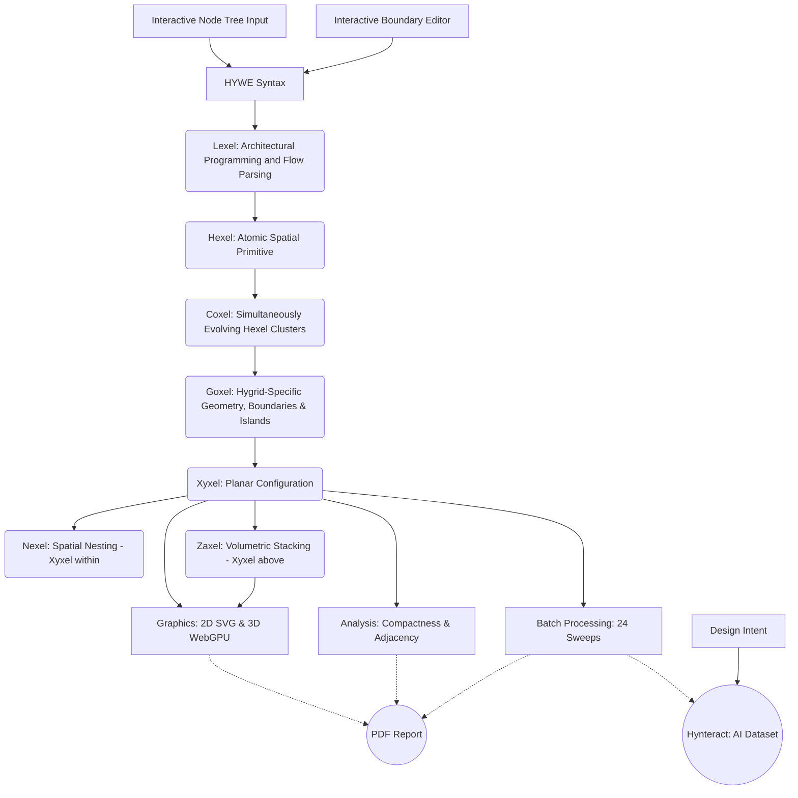

**HYWE** is a **computational spatial design environment and experimental research project** where **structured intent** metamorphoses into **spatial configurations** through **deterministic design computation**.

---

---
# H Y W E

**Hy**grid **W**oven **E**nsemble — *Computational Spatial Design Environment*

    

**[Launch HYWE](https://vykrum.github.io/Hywe/)**

*Actively evolving. WebGPU browser recommended.*

---

> **HYWE** is the application and research environment. This repository contains the open-source implementation of the **HYWE Engine** and its browser-based application.
>
> - **[HYWE Web App](https://hywe.in)** (`hywe.in`) — Interactive spatial design environment.
> - **[HYWE Engine](https://github.com/vykrum/Hywe)** (`repo.hywe.in`) — Computational engine and open-source implementation.
> - **[HYWE Wiki](https://wiki.hywe.in)** (`wiki.hywe.in`) — Technical documentation and research reference.
> - **[HYWE Data](https://data.hywe.in)** (`data.hywe.in`) — Structured spatial training data.
>
> *If you are here to use HYWE, start with the **Web App** and the **Wiki**. If you are here to understand, extend, or reproduce the computational logic, explore this repository.*

---

## Philosophy

> [!IMPORTANT]
> **HYWE is strictly a conceptual layout engine, not a comprehensive architectural modeling or lifecycle management platform.** It does not attempt to replicate the detailed parametric modeling, structural documentation, or construction-level detailing inherent to industry-standard building modeling suites. HYWE operates exclusively at the early, exploratory stages of design, focusing entirely on flow-based spatial topology and deterministic volume generation. Evaluating HYWE's outputs against fully-featured, production-ready modeling platforms misrepresents its core intent and operational scope.

HYWE is an investigation into spatial reasoning as a function of computational logic. It explores a methodology where **hierarchical programming and relational flow** drive spatial generation.

At its core is the **Hygrid**, an integer hybrid lattice designed for deterministic topology-driven spatial synthesis. By trading geometric isotropy for arithmetic determinism, Hygrid maintains strict integer closure and enables HYWE to execute kernel-free within WebAssembly. 

In this system:
- **Connectivity** is the declared relational graph - the architectural requirement that nodes belong to structured flows and programmatic branches.
- **Adjacency** is not prescribed as an arbitrary pairwise matrix; it is an emergent geometric and topological consequence of connectivity, directional sequence rules, and lattice packing constraints.

By replacing manual geometric drafting with a **visual node tree interface**, HYWE lowers the barrier to topological exploration, allowing designers to map out programmatic hierarchies while the engine deterministically weaves this intent into a cohesive spatial **Ensemble**.

---

### Overview
<video src="https://github.com/user-attachments/assets/b285dbd8-33bd-45c1-998e-87e2ce0b0d0d" width="100%" controls autoplay loop muted></video>

### Interface & Functional Modules
*Click any interface preview to view in full resolution.*

| **Intro & Hierarchy** | **Layout Generation** | **Volumetric Massing** | **Spatial Analysis** |
| :---: | :---: | :---: | :---: |
|  Interactive node-tree programmatic hierarchy |  Deterministic Hygrid planar packing & SVG export |  WebGPU 3D vertical stacking & massing |  Compactness metrics & graph adjacency verification |
| **Procedural Generation** | **Boundary Condition** | **Dataset Preparation** | **Report Compilation** |
|  24 canonical operator sequence sweep sweeps |  Polygon boundary capture & site confinement |  Base34 grid compression & JSONL dataset commit |  Automated multi-page PDF spatial dossiers |

---

## Operational Domain

HYWE functions as an experimental apparatus bridging abstract programmatic intent and physical constraints. The engine translates **architectural programming** (hierarchical trees, room capacities, and sequence operators) directly into resolved planar and volumetric layouts.

The spatial logic incorporates **boundary confinement**, enabling configurations to adapt to irregular site boundaries and non-standard footprints. Vertically, this reasoning extends to resolve **programmatic stacking**, spatial nesting, and multi-level circulation across building massing.

---

## Conceptual & Technical Architecture

HYWE separates user-facing architectural concepts from internal computational modules:

| Architectural Stage | Domain Concept | Implementation Component | Computational Transformation | Output Representation |
| :--- | :--- | :--- | :--- | :--- |
| **Intent & Scope** | Programmatic Hierarchy & Boundary Rules | `NodeTree` & `BoundaryEditor` | User input graph construction & polygon boundary capture | Abstract Design Intent |
| **Encoding** | Symbolic Rule Representation | HYWE Syntax | Compact, deterministic serialization | Canonical `.hyw` String |
| **Parsing** | Programmatic Flow Tokenization | `Lexel` | AST parsing, token extraction, and hierarchy validation | `TreeNode` Tree |
| **Quantization** | Lattice Coordinate Allocation | `Hexel` | Spatial discretization on the discrete integer Hygrid | Integer Coordinate Lattice |
| **Clustering** | Emergent Spatial Grouping | `Coxel` | Synchronous outward growth and collision resolution | Spatial Cluster Fabric |
| **Geometry** | Hygrid Spatial Boundaries & Islands | `Goxel` | Generates Hygrid-specific geometry, boundary capture, clipping, & islands | Verified Boundary Topology |
| **Planar Layout** | 2D Spatial Distribution | `Xyxel` | Sequence-driven planar placement & orientation sweeps | Planar Layout & SVG |
| **Nesting** | Sub-space Containment (*Xyxel within*) | `Nexel` | Child cluster nesting within parent coordinate envelopes | Multi-level Hierarchy |
| **Massing** | 3D Stacking & Volumetric Form (*Xyxel above*) | `Zaxel` | Vertical floor stacking and level elevation assignment | WebGPU 3D Mesh |
| **Visualization** | Multi-modal Viewports | `Graphics` | 2D planar SVG rendering and WebGPU 3D massing viewport | Visual Interfaces |
| **Evaluation** | Spatial Metrics & Verification | `Analyze` | Compactness, graph adjacency verification, and PDF export | Performance Reports |
| **Exploration** | Systematic Permutation | `Batch` / `Teach` | Full-space sequence sweep exploration (24 canonical operators) | Multi-variation Records |

---

### Downstream Application: Structured Data Serialization

As a downstream capability of its discrete, syntax-first architecture, HYWE provides an automated export pipeline to generate the **[HYWE Architectural Training Data](https://huggingface.co/datasets/vykrum/hywe-training-data)**. Rather than relying on heavyweight or ambiguous 3D file formats, the system pairs natural-language spatial intent with compact, deterministic HYWE syntax strings and Base34 grid encodings.

#### System Flow
`Design Intent` ➔ `HYWE Syntax` ➔ `24-Operator Sequence Sweeps` ➔ `Hynteract Ingestion` ➔ `JSONL Dataset Commit`

- **Container-First Layout**: Each record encodes one container (`L0`, `L1`, `N1`, etc.) containing all 24 sequence sweep variations positionally aligned with the room header.
- **Base34 Coordinate Compression**: Hexagonal grid coordinates are encoded in Base34 strings for compact representation.
- **Full Sequence Sweeps**: Every record covers the complete space of 24 canonical sequence rules for each layout container.

---

## Technical Architecture

The **HYWE core spatial engine is dependency-free** and executes kernel-free in WebAssembly. The web application leverages [Bolero](https://fsbolero.io/) (Blazor on WASM) and Elmish for reactive state management, alongside native WebGPU for 3D rendering. 

In this architecture, **Syntax is the primary source of truth**: every layout is a pure, deterministic transformation of its underlying AST and sequence rules, ensuring identical reproduction across runs on the same engine version.

```mermaid
graph TD
    A1[Interactive Node Tree Input] --> B[HYWE Syntax]
    A2[Interactive Boundary Editor] --> B[HYWE Syntax]
    B --> C(Lexel: Architectural Programming and Flow Parsing)
    C --> D(Hexel: Atomic Spatial Primitive)
    D --> E(Coxel: Simultaneously Evolving Hexel Clusters)
    E --> Gx(Goxel: Hygrid-Specific Geometry, Boundaries & Islands)
    Gx --> F(Xyxel: Planar Configuration)
    
    F --> N(Nexel: Spatial Nesting - Xyxel within)
    F --> G(Zaxel: Volumetric Stacking - Xyxel above)
    
    F --> Gr[Graphics: 2D SVG & 3D WebGPU]
    G --> Gr
    F --> H[Analysis: Compactness & Adjacency]
    F --> I[Batch Processing: 24 Sweeps]
    
    Gr -.-> ReportLabel((PDF Report))
    H -.-> ReportLabel
    I -.-> ReportLabel
    
    I -.-> DatasetLabel((Hynteract: AI Dataset))
    DesignIntent[Design Intent] --> DatasetLabel
```
---

## Technical Stack

- **Language:** [F#](https://fsharp.org/) (functional-first design)
- **Frontend:** [Bolero](https://fsbolero.io/) (Blazor on WASM)
- **3D Graphics:** [WebGPU](https://gpuweb.github.io/gpuweb/) (native massing)

---

## Documentation

- **[HYWE Wiki](https://github.com/vykrum/Hywe/wiki)**: In-depth tutorials, spatial concepts, architectural programming guides, and technical references.
- **[Methodology & Scientific Protocol](docs/METHODOLOGY.md)**: Formal definitions of determinism, the adjacency principle, architectural grammar semantics, and benchmark standards.

---

## Development

HYWE is an open project exploring **design computation**. 

Those interested in extending the engine or exploring its procedural logic can refer to the [Contributing Guide](CONTRIBUTING.md). Additionally, a technical summary of the architecture is maintained at [llms.txt](llms.txt) for AI agents and automated analysis.

---

## License

This project is licensed under the [MIT License](LICENSE).
