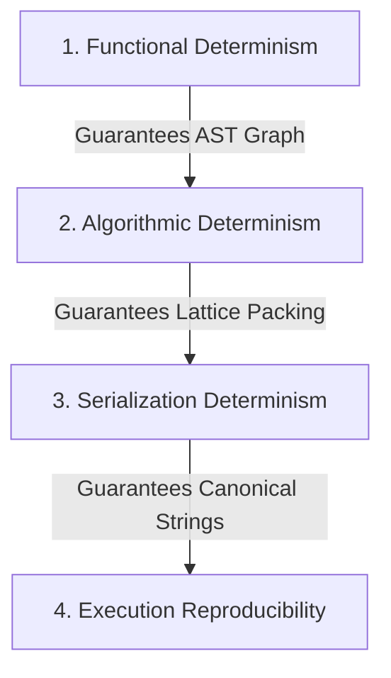
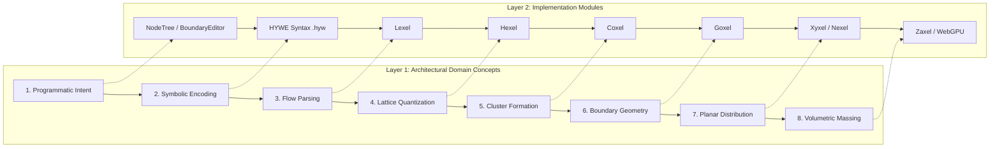

# HYWE Methodology & Scientific Protocol

> **A formal framework for documentation rigor, claim/evidence calibration, architectural semantics, and benchmark reproducibility.**

---

## 1. Epistemic Demarcation Framework

To maintain scientific integrity across the HYWE documentation, Wiki, and research papers, all technical statements must adhere to a strict four-tier epistemic demarcation:

```
┌─────────────────────────────────────────────────────────────────────────────┐
│                       EPISTEMIC DEMARCATION RUBRIC                          │
├─────────────────┬───────────────────────────────────────────────────────────┤
│ [IS]            │ Implemented & Verified in Code                            │
│                 │ Pure computational mechanisms, AST structures, or algorithms│
│                 │ directly verifiable in the source codebase.              │
├─────────────────┼───────────────────────────────────────────────────────────┤
│ [DEMONSTRATES]  │ Empirically Observed & Verified on Tested Domain          │
│                 │ Empirical performance, topology hash matches, or         │
│                 │ benchmark results over canonical test sets. (Must NOT be  │
│                 │ generalized into unverified universal proofs).          │
├─────────────────┼───────────────────────────────────────────────────────────┤
│ [HYPOTHESIZES]  │ Theoretical Proposition Awaiting Testing                  │
│                 │ Mathematical, topological, or architectural hypotheses   │
│                 │ whose general boundaries remain under active study.       │
├─────────────────┼───────────────────────────────────────────────────────────┤
│ [HORIZON]       │ Future Practice & Vision                                  │
│                 │ Hypothesized workflows, design studio integrations, and   │
│                 │ long-term architectural practice applications.            │
└─────────────────┴───────────────────────────────────────────────────────────┘
```

### Documentation Authoring Guidelines:
- **Avoid Universal Claims on Empirical Evidence**: Never state that a test suite *"ensures universal invariants across all possible inputs"*. State instead: *"provides empirical verification of topological consistency across the tested canonical input suite under engine build X"*.
- **Distinguish Design Intent from UX Claims**: Distinguish between UX goals (*"HYWE is designed to eliminate the need for manual coordinate drafting"*) and unsupported empirical claims (*"has no learning curve"*).

---

## 2. Taxonomy of Determinism

In design computation, the term *"determinism"* is often overloaded. HYWE formally defines four distinct layers of determinism:



1. **Functional Determinism**:
   - Pure functions mapping identical AST inputs to identical relational graphs without side effects or hidden global state.
2. **Algorithmic Determinism**:
   - The integer lattice (Hygrid) eliminates floating-point IEEE-754 precision drift. Given identical coordinate seeds and sequence operators, collision resolution and growth heuristics follow a deterministic priority order.
3. **Serialization Determinism**:
   - Canonical representation rules ensure that any given spatial topology serializes to exactly one `.hyw` AST string and one Base34 coordinate payload.
4. **Execution Reproducibility**:
   - The empirical observation that running the same canonical input on a specified engine build across supported platforms (WebAssembly/Mono) yields identical topology hash signatures.

---

## 3. Relational vs. Spatial Concepts: The Adjacency Principle

A fundamental conceptual tenet of HYWE is that **spatial adjacency is an emergent property, not an input parameter**.

```
┌─────────────────────────────────────────────────────────────────────────────┐
│                            THE ADJACENCY PRINCIPLE                          │
├─────────────────┬───────────────────────────────────────────────────────────┤
│ Concept         │ Definition                                                │
├─────────────────┼───────────────────────────────────────────────────────────┤
│ Connectivity    │ The declared relational requirement that two spaces       │
│                 │ belong to the same functional branch, circulation path, or│
│                 │ programmatic container.                                   │
├─────────────────┼───────────────────────────────────────────────────────────┤
│ Hierarchy       │ The parent-child tree relationship defining programmatic  │
│                 │ enclosure, nesting depth, and primary circulation flow.   │
├─────────────────┼───────────────────────────────────────────────────────────┤
│ Sequence        │ The directional orientation and growth sweep rule applied  │
│                 │ to resolve spatial placement order on the lattice.        │
├─────────────────┼───────────────────────────────────────────────────────────┤
│ Topology        │ The abstract relational structure describing connections  │
│                 │ and neighbor graphs independent of exact metric shape.    │
├─────────────────┼───────────────────────────────────────────────────────────┤
│ Adjacency       │ The emergent geometric consequence describing whether two │
│                 │ resolved spaces share a physical boundary on the Hygrid.  │
└─────────────────┴───────────────────────────────────────────────────────────┘
```

> [!NOTE]
> **Summary**: Designers specify *Connectivity*, *Hierarchy*, and *Sequence*. The HYWE engine resolves geometry on the integer Hygrid such that *Adjacency* emerges naturally without requiring the user to solve an over-constrained pairwise matrix.

---

## 4. Architectural Semantics of HYWE Grammar

The HYWE grammar is not merely a syntax for coordinate generation; every syntactic token encodes an architectural proposition:

| Syntactic Token | Grammar Representation | Architectural Meaning | Computational & Geometric Consequence |
| :--- | :--- | :--- | :--- |
| **`1`** | Root Node ID | Primary programmatic anchor (e.g., Foyer, Core, Lobby). | Seeds the initial Base Hexel at origin `(0,0,0)`. |
| **`1.1`**, **`1.1.2`** | Hierarchical Branch ID | Secondary / tertiary programmatic dependency or suite containment. | Enforces parent-to-child growth vector and spatial clustering around the parent anchor. |
| **`/14/`** | Target Capacity / Size | Relative spatial capacity or target area budget. | Allocates the count of contiguous Hexels to be woven into the node's Coxel cluster. |
| **`/Bed-1/`** | Program Label | Functional room identification and grouping semantics. | Tags generated polygon metadata and boundary edge attributes. |
| **`(1.1.1.2.1/8/Bath-1)`** | Enclosed Node Tuple | A dedicated sub-service space (e.g., en-suite bath attached to Bed-1). | Restricts initial growth seeds to the perimeter of parent node `1.1.1.2`. |
| **`L0`**, **`L1`**, **`N1`** | Container Marker | Vertical level stacking (`L`) or internal nested precinct (`N`). | Defines independent coordinate planes resolved vertically via Zaxel or locally via Nexel. |
| **`VRCWEE`** | Sequence Operator (6-char) | Directional layout sweep (Vertical/Horizontal, Clockwise/Counter, Cardinal entry/exit). | Dictates deterministic tie-breaking during lattice expansion. |

---

## 5. Two-Layer Vocabulary Architecture

To prevent implementation terminology from obscuring architectural theory, HYWE maintains a strict two-layer vocabulary:



---

## 6. Scientific Benchmark Protocol & Reproducibility

When publishing performance, scaling, or conformance metrics, reports must satisfy the following protocol:

### 1. Telemetry & Environment Specification
Every benchmark run must report:
- **Runtime Environment**: OS version, browser engine, WASM runtime (Mono / .NET), build configuration (`Release`).
- **Hardware Profile**: CPU model, core/thread count, available memory.

### 2. Isolated Measurement Boundary
- Timings must strictly measure core computational transformations (`runCompilation`).
- DOM tree mutations, SVG string serialization, CSS re-layouts, and WebGPU pipeline allocations must be decoupled from engine benchmarks unless explicitly stated as an end-to-end UX benchmark.

### 3. Warm-up & Garbage Collection Protocol
- **Cold vs. Warm Deconstruction**: The first un-warmed invocation must be logged separately as `Cold Latency` (capturing JIT/WASM tiering, assembly loading, and static memory allocation).
- **Steady-State Statistics**: A minimum of 2 warm-up cycles must precede recorded steady-state iterations.
- **Memory Isolation**: Explicit generation sweeps (`GC.Collect()`) must occur between operator batches to prevent garbage collection pauses from skewing individual operator runs.
